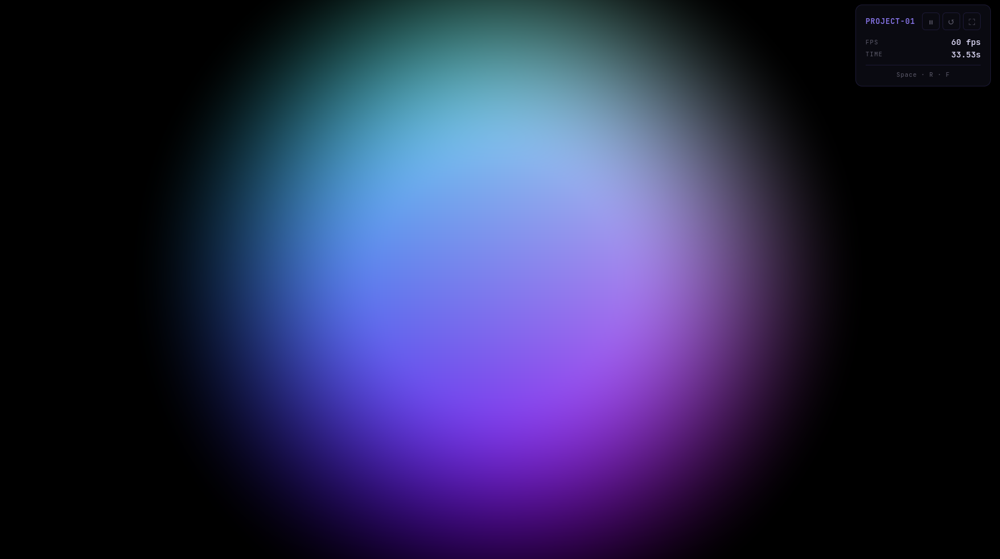

# shadertoy

Local development environment for [ShaderToy](https://www.shadertoy.com)-compatible GLSL shaders.



## Usage

```bash
./shadertoy 01    # serve project-01 and open it in the browser
./shadertoy 2     # numbers are auto-padded (→ project-02)
```

Press **Space** to pause, **R** to restart, **F** for fullscreen.

## Structure

```
shadertoy/
├── src/
│   └── project-01/
│       └── shader.glsl     ← GLSL source (one file per project)
├── runner/
│   ├── index.html          ← full-screen WebGL2 canvas + HUD
│   ├── runner.js           ← ShaderToy runtime (uniforms, render loop)
│   └── style.css
├── server.js               ← zero-dependency local HTTP server
├── shadertoy               ← CLI entry point
└── package.json
```

## Adding a new project

Create `src/project-NN/shader.glsl` with a standard ShaderToy entry point:

```glsl
void mainImage(out vec4 fragColor, in vec2 fragCoord) {
    vec2 uv = fragCoord / iResolution.xy;
    fragColor = vec4(uv, 0.5 + 0.5 * sin(iTime), 1.0);
}
```

Then run:

```bash
./shadertoy 02
```

## Uniforms

All standard ShaderToy uniforms are injected automatically — you do not need to declare them:

| Uniform | Type | Description |
|---|---|---|
| `iResolution` | `vec3` | Viewport size in pixels (`z` = pixel ratio) |
| `iTime` | `float` | Elapsed seconds since start / last restart |
| `iTimeDelta` | `float` | Seconds since last frame |
| `iFrame` | `int` | Frame counter |
| `iMouse` | `vec4` | `xy` current position, `zw` last-click position |
| `iDate` | `vec4` | Year, month (0-based), day, seconds since midnight |

## Requirements

- Node.js (any recent version) — for the server
- A browser with WebGL2 support (Chrome, Firefox, Edge)
